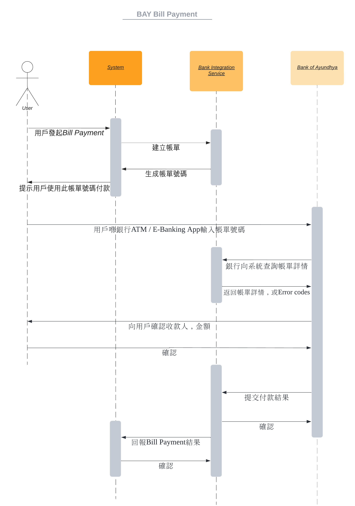

## 乜嘢係Bill Payment

字面意思，Bill Payment就係帳單繳付。以日常生活為例，我哋張水電煤但上面都有個帳單號碼，我哋可以透過帳單號碼交錢，呢個過程就係Bill Payment。

## Bill Payment Flow

咁喺系統入面又做咗啲咩呢？以下將以大城銀行嘅Bill Payment為例。

1. 收款方俾個Bill Number你
2. 你喺銀行E-Banking / ATM輸入Bill Number後確認
3. 銀行向收款方發送Inquiry Request查詢
4. 收款方向銀行回覆Inquiry Response
5. 你確認金額、收款方資料等
6. 銀行向收款方發送Confirm Request
7. 收款方向銀行回覆Confirm Response

## 交換系統資料

同銀行做Integration需要提供 / 交換以下資料

<Alert title="所有Endpoints都需要有HTTPS" description="" status="warning"/>

1. 我哋嘅Endpoints（接收銀行發起嘅請求 / 發送請求嘅 Server）
   - Inquiry Request `(https://{server:port}/krungsri/bill-payment/inquiry)`
   - Confirm Request `(https://{server:port}/krungsri/bill-payment/confirm)`
   - Reverse Request `(https://{server:port}/krungsri/bill-payment/reverse)`
   - Payment Lookup - Provided by Bank of Ayundhya
2. Server嘅SSL Certificate，必須係IP Signed嘅Certificate
3. 我哋系統認證嘅方法，如API Key或OAuth2
4. 安裝BAY提供嘅SSL Certificate

## 系統設計

假設喺Microservices嘅環境，只需要顧及有關BAY Bill Payment嘅物件且唔考慮效能嘅情況下，我會考慮以下兩點：
1. Traceability 可追溯性
   - 當問題出現，可以睇翻條Record
2. Recoverability 可恢復性
   - 當問題出現，可以重新Process未Process過嘅Record

喺Traceability上，我哋可以用NoSQL去紀錄所有銀行Send過嚟嘅Traffic，而BAY每一個API Call都會帶有一個Unique嘅UUID作識別，當有問題出現需要兩方溝通嘅時候，可以用呢個UUID去進行排查。

喺Recoverability上，我哋可以喺接收Request當刻直接Push入Database，如果系統出現問題，Restart嘅時候都可以睇翻Database睇邊啲未Process。進階啲可以考慮用Kafka，呢度就不詳述了。

我哋亦需要Expose Endpoints俾自家其他components用，主要係俾佢哋建立帳單同查詢帳單，當收到銀行Confirm收錢之後亦需要Update其他components。

成個過程就好似下面幅圖咁：

## Example Repository

後加啦