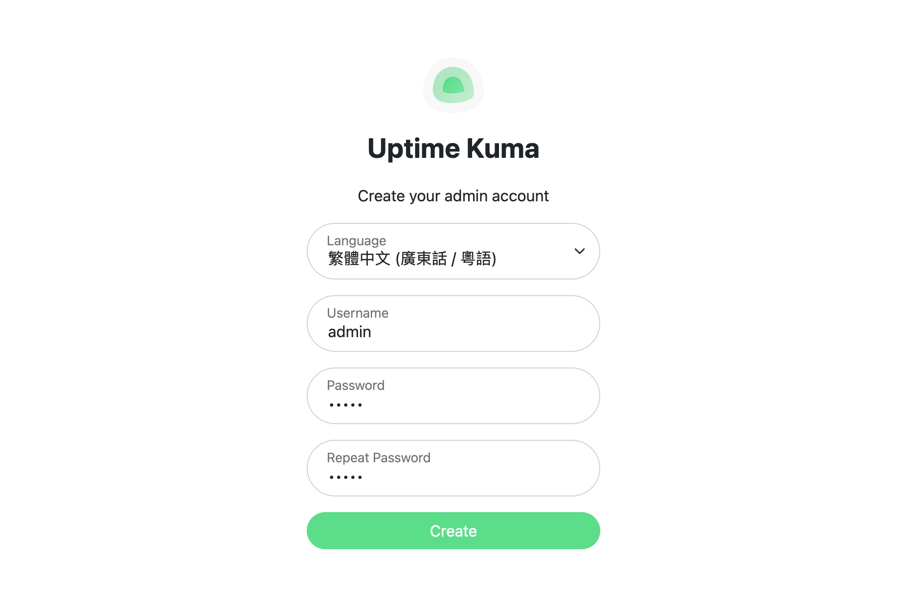
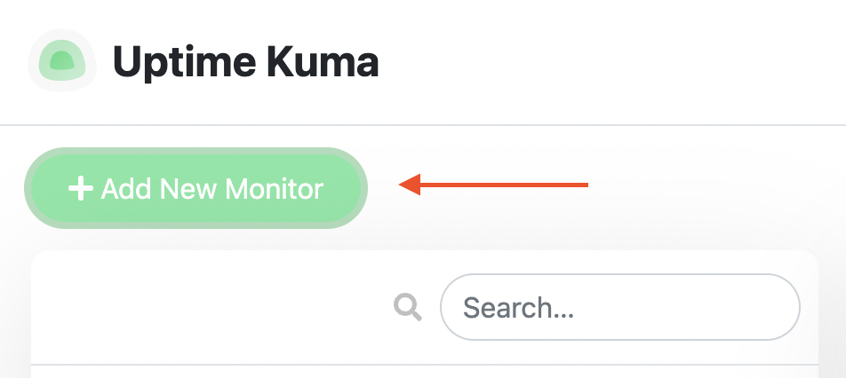
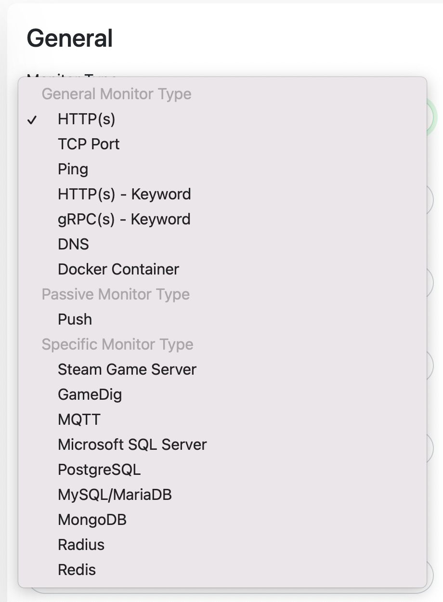
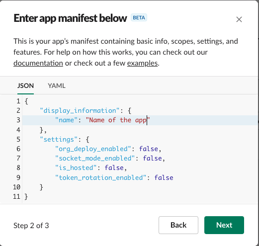
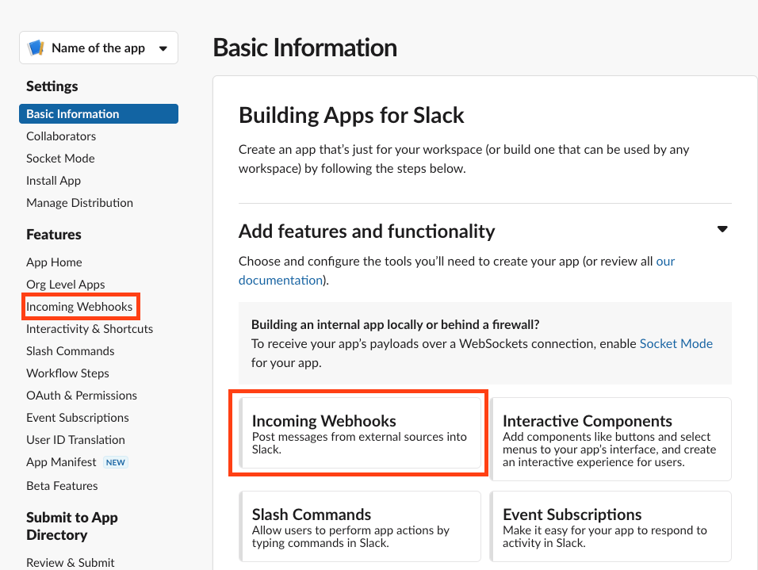
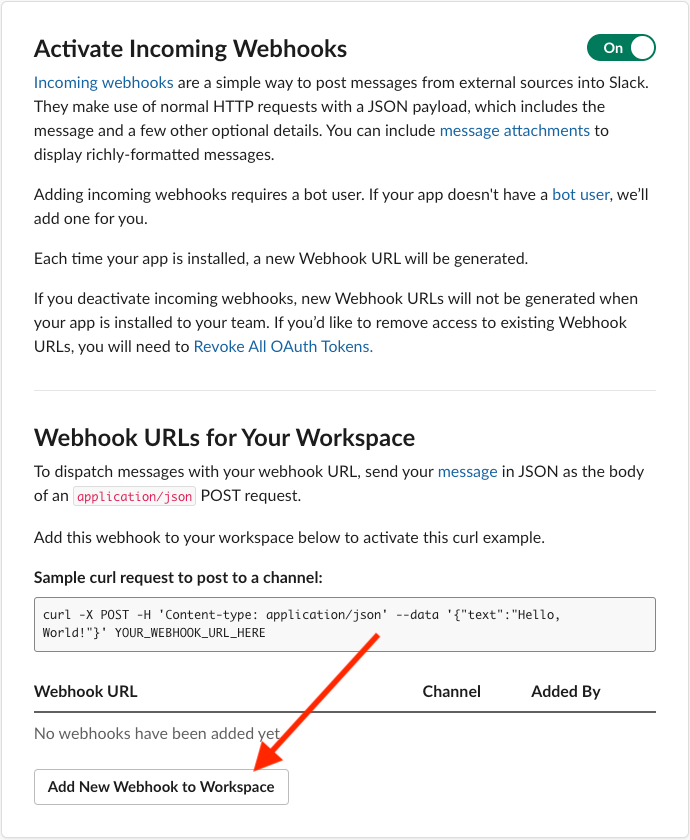
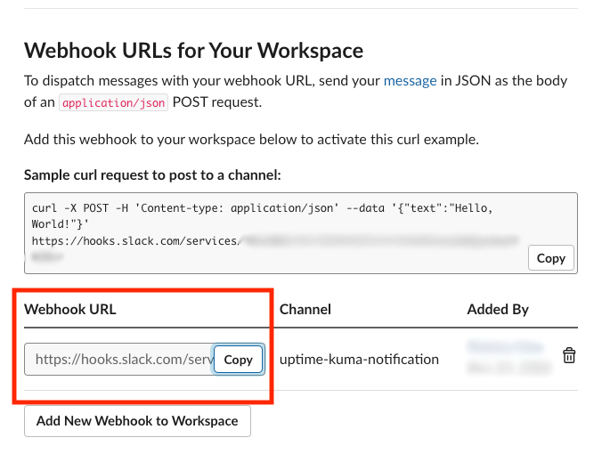
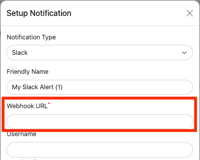

<script>
  import GitHub from '$lib/components/extra/github.svelte'
</script>

<GitHub user="louislam" repo="uptime-kuma"/>

## 點解要用
筆者曾經喺一間Startup做嘢，入面有12個Wordpress網站需要管理，經常遇到大大少少嘅問題，例如個網站死咗，或者張SSL Cert過咗期，好多時都要去到User Report現發現到個網站出事。所以後嚟直接搬曬上Cloud，再加個Monitoring嘅Tool去睇住啲網站，而今次要介紹嘅就係一個可以Monitor網站嘅Tool - **Uptime Kuma**

## 安裝

Docker: 
```
docker run -d --restart=always -p 3001:3001 -v uptime-kuma:/app/data --name uptime-kuma louislam/uptime-kuma:1
```

如果你想Customize網站Style，例如logo同顏色，你就要Fork落嚟改。

npm:
```
git clone https://github.com/louislam/uptime-kuma.git
cd uptime-kuma
npm run setup 
# or
npm run build

# Option 1. Try it
node server/server.js

# (Recommended) Option 2. Run in background using PM2
# Install PM2 if you don't have it: 
npm install pm2 -g && pm2 install pm2-logrotate

# Start Server
pm2 start server/server.js --name uptime-kuma


```

## 首次設定

1. 第一次入要建立Account



2. 之後透過左上角"Add New Monitor"，喺Url輸入你想mon住嘅網站



3. 可以見到Monitor Type支援多種模式，最常用係HTTP(s)



4. 如果你想healthcheck backend services，可以改Method同Payload
5. Save之後就會開始運作


## 常用設定

#### 重設 Admin Password

```powershell
docker exec -it <container name> bash # 如果用Docker

npm run reset-password
```

#### 設定 Slack 通知

1. 喺 https://api.slack.com/apps?new_app=1 建立Slack Application



2. 啟用Incoming Webhook



3. Click **Add New Webhook to Workspace**



4. 揀一個接收通知嘅Channel


5. 複製生成嘅Webhook URL




6. 喺Uptime Kuma，入**Settings** -> **Notifications** -> **Setup Notification**，Notification Type揀Slack，然後貼上啱啱複製嘅Webhook URL

