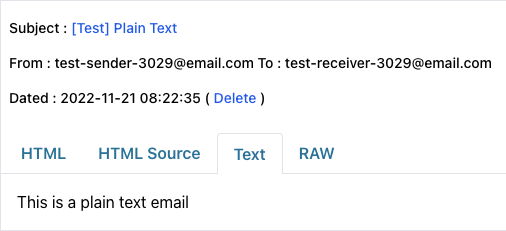

## 咩係 Spring Mail

Spring Mail

## 咩係 FreeMarker

FreeMarker係一個Template Engine，同Thymeleaf一樣可以用嚟Render Html做Server Side Render嘅網站，唔同於Thymeleaf嘅係，FreeMarker可以用喺Html以外嘅File，例如xml、yaml等，依家用嚟整Email Template都非常好用。

## 所需 Dependencies

- Spring Mail
- FreeMarker
- Lombok (Optional)

## 設置 Spring Mail Sender

我用[WPOven](https://www.wpoven.com/tools/free-smtp-server-for-testing)嘅免費SMTP Server嚟做測試，所以唔需要入Username Password，正常都係必須入的，以AWS 嘅Simple Email Service為例，你就需要Create一個專Send Email嘅IAM User。


<script>
  import Alert from '$lib/components/extra/alert.svelte'
</script>
<Alert title="如果你想用JUnit試，copy application.yml去test/resources" description="" status=""/>

```yaml title="application.yml"

spring:
  mail:
    host: smtp.freesmtpservers.com
    port: 25
    username: # SMTP Username
    password: # SMTP Password
    properties:
      mail:
        smtp.auth: false # 如果SMTP需要帳戶密碼，set做true
        starttls.enable: true # TLS Connection Flag

```

## Spring Mail Implementation

### 發送純文字Email


```java title="MailServiceImpl.java"

@Service // MVC格式，implement一個interface再寫implementation
public class MailServiceImpl implements MailService {

    // Autowired JavaMailSender
    @Autowired private JavaMailSender mailSender;

    // 定義發送者電郵地址，常見嘅有no-reply@email.com
    private static final String SENDER_ADDRESS = "test-sender-3029@email.com";

    // 發送純文字電郵
    public void sendPlainTextEmail(String subject, String content, String... recipientEmailAddresses) {
        SimpleMailMessage message = new SimpleMailMessage();
        message.setSubject(subject); // 郵件標題
        message.setFrom(SENDER_ADDRESS);
        message.setTo(recipientEmailAddresses); // 收件人電郵地址
        message.setText(content); // 郵件內容

        this.mailSender.send(message);
    }

}
```

### 發送Html Email

```java title="MailServiceImpl.java"
@Service // MVC格式，implement一個interface再寫implementation
public class MailServiceImpl implements MailService {

    // Autowired JavaMailSender
    @Autowired private JavaMailSender mailSender;

    // 定義發送者電郵地址，常見嘅有no-reply@email.com
    private static final String SENDER_ADDRESS = "test-sender-3029@email.com";

    // 發送HTML Email
    public void sendHtmlEmail(String subject, String htmlContent, String... recipientEmailAddresses) throws MessagingException {
          MimeMessage mimeMessage = mailSender.createMimeMessage();
          MimeMessageHelper helper = new MimeMessageHelper(mimeMessage);
          helper.setSubject(subject); // 郵件標題
          helper.setFrom(SENDER_ADDRESS);
          helper.setTo(recipientEmailAddresses); // 收件人電郵地址
          helper.setText(htmlContent, true); // 使用Html格式的郵件內容
          mailSender.send(mimeMessage);
    }
}
```

### 複數SMTP senders

如果你想一個Application可以用多過一個嘅SMTP Sender去send email，你就唔可以就咁喺```application.yml```度設定，需要到Code層面去起唔同Sender嘅Instance。

```java 


```

## FreeMarker Implemetation

### 建立Template

首先喺```resources/templates```下建立一個FreeMarker Template，例如```verification.ftl```。
<!-- 請留意variable嘅命名，```${verification.code}```當中嘅```verification```係你將會定義嘅object key， -->

```html title="verification.ftl"

<!DOCTYPE html>
<html lang="en">
<body>

    <div>
        <h3>Authentication Code</h3>
        <p>${verification.code}</p>
    </div>

</body>
</html>

```

### 建立與Template關聯嘅Class
喺呢個Class入面，你可以定義Template會用到嘅變數，以驗證電郵為例，code就係一個變數

<Alert title="Field名（例如code）最好跟FreeMarker Template" status="warning"/>

```java title="VerificationTemplate.java"

@Data
public class VerificationTemplate {
    private String code;
}


```


### 發送Templated Email

```java

@Service
public class MailServiceImpl implements MailService {

    // Autowired JavaMailSender
    @Autowired private JavaMailSender mailSender;

    // Autowired freemarker.template.Configuration
    @Autowired private Configuration configuration;

    // 定義發送者電郵地址，常見嘅有no-reply@email.com
    private static final String SENDER_ADDRESS = "test-sender-3029@email.com";

    // 發送認證格式郵件
    public void sendVerificationEmail(String subject, String code, String... recipientEmailAddresses) 
            throws IOException, TemplateException, MessagingException {
        
        VerificationTemplate verificationTemplate = VerificationTemplate.builder()
                .code(code)
                .build();

        StringWriter stringWriter = new StringWriter();
        Map<String, Object> model = new HashMap<>();
        // 呢度嘅Key要同Template入面variable嘅prefix一樣
        model.put("verification", verificationTemplate);
        // Freemarker會攞verfication.ftl然後map翻啲variable，再將結果寫入stringWriter
        configuration.getTemplate("verification.ftl").process(model, stringWriter);
        
        String templatedContent = stringWriter.getBuffer().toString();
        
        this.sendHtmlEmail(subject, templatedContent, recipientEmailAddresses);
    }

}
```

## 測試

### 用JUnit測試嘅Code

```java

@SpringBootTest
public class MailServiceImplTest {

    @Autowired
    private MailServiceImpl mailService;

    @Autowired
    private Configuration configuration;

    @Test
    public void testSendPlainTextEmail() {

        String subject = "[Test] Plain Text";
        String content = "This is a plain text email";
        String recipient = "test-receiver-3029@email.com";

        mailService.sendPlainTextEmail(subject, content, recipient);
    }

    @Test
    public void testSendHtmlEmail() throws MessagingException {

        String subject = "[Test] HTML";
        String content = "<h1>This is a HTML email</h1>";
        String recipient = "test-receiver-3029@email.com";

        mailService.sendHtmlEmail(subject, content, recipient);
    }

    @Test
    public void testSendTemplatedVerificationEmail() throws MessagingException, TemplateException, IOException {

        String subject = "[Test] Templated";
        String code = "123456";
        String recipient = "test-receiver-3029@email.com";

        this.mailService.sendVerificationEmail(subject, code, recipient);
    }

}
```

### 結果

1. Plain text email



2. Html Email


3. Templated Email


